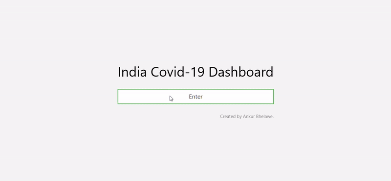
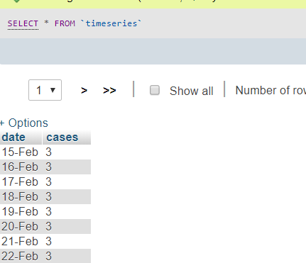
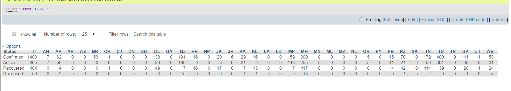

# javaFX_Covid19Dashboard
JavaFX code for a simple Covid 19 Dashboard with a graph and css buttons with hover effects. Data for this application is taken from a MYSQL database via JDBC.

## System Requirements:

The system must have JDK 8 and NetBeans installed. The system must also have MYSQL. Table definition has been done as shown below:

### Timeseries for graph:

### State Statistics

_______